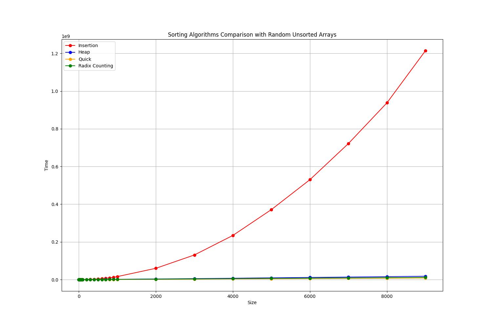
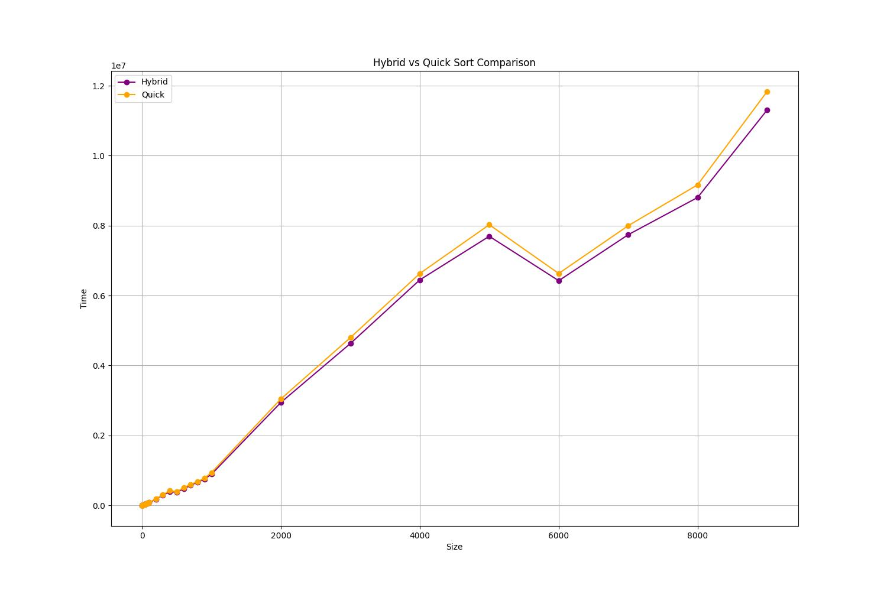

# Sorting Algorithms Execution Time Comparison

This project compares the execution times of several sorting algorithms: Insertion Sort, Heap Sort, Quick Sort, Radix Sort, and Counting Sort. Additionally, it demonstrates the implementation of a hybrid sort algorithm, combining the strengths of multiple sorting methods.

## Algorithms Implemented
- **Insertion Sort**
- **Heap Sort**
- **Quick Sort**
- **Radix Sort**
- **Counting Sort**
- **Hybrid Sort**: A custom algorithm designed to optimize sorting performance by combining different sorting techniques.

## Features
- Execution time measurement for each sorting algorithm.
- Comparison charts and statistics to analyze performance.
- Customizable input data size and range for comprehensive testing.
- Implementation details and explanations for each sorting algorithm.

